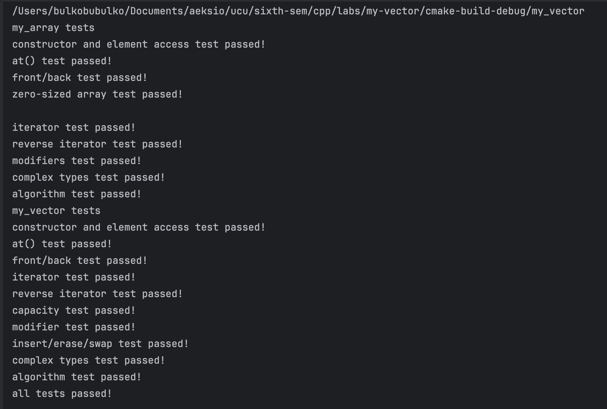

# Lab work 3: my_vector
Authors (team): [Yuliia Moliashcha](https://github.com/bulkobubulko)
## Prerequisites

GCC, CMAKE

### Compilation

```
mkdir build && cd build
cmake ..
make
```

## Usage

```
./my_vector
```

Example output:

Tests do pass.